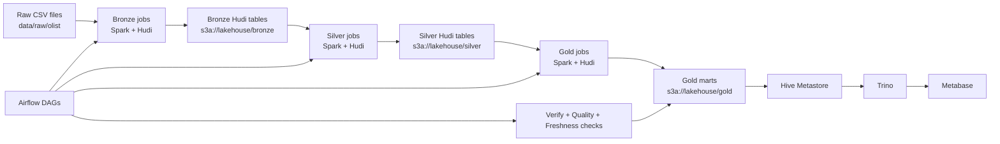

# Big Data Hudi E-commerce Pipeline

Local lakehouse project for e-commerce analytics built on `Apache Hudi`, `Spark`, `Trino`, `Airflow`, `MinIO`, and `Metabase`. The project ingests raw Olist CSV datasets, organizes them into `bronze -> silver -> gold` layers, validates data quality, exposes marts for BI, and includes Hudi-specific demos such as `incremental upsert` and `time travel`.

## Description

This repository implements a complete local data platform for batch analytics on e-commerce data. The core idea is:

- ingest raw source files into a local S3-compatible lake
- store curated tables in Hudi
- transform them across medallion layers
- orchestrate everything with Airflow
- query marts with Trino
- visualize results in Metabase

It is designed as a reproducible end-to-end pipeline rather than only a collection of Spark scripts.

## Objective

- Build a local lakehouse pipeline around `Apache Hudi`
- Model e-commerce data through `bronze`, `silver`, and `gold` layers
- Validate pipeline correctness with row-count, quality, freshness, and reconciliation checks
- Serve analytical marts for SQL and BI consumption
- Demonstrate Hudi capabilities beyond plain Parquet, especially:
  - `incremental upsert`
  - `time travel`

## Dataset

Main dataset:

- `Olist Brazilian E-Commerce Public Dataset`

Source files are stored under:

- `data/raw/olist/`

Main entities used in the pipeline:

- `orders`
- `order_items`
- `customers`
- `payments`
- `products`
- `sellers`
- `reviews`
- `geolocation`
- `product_category_translation`

These raw CSV files are transformed into:

- `bronze`: raw-preserving Hudi tables
- `silver`: cleaned and standardized Hudi tables
- `gold`: serving marts for analytics and BI

## Tools And Technologies

- `Apache Spark 3.5.8`: ETL and Hudi read/write jobs
- `Apache Hudi 1.1.1`: transactional lake table format
- `MinIO`: S3-compatible object storage
- `Hive Metastore`: metadata catalog for lakehouse tables
- `Trino`: SQL query engine
- `Apache Airflow 3`: orchestration and scheduling
- `Metabase`: BI and dashboard layer
- `Docker Compose`: local platform orchestration
- `Python`: pipeline jobs, helpers, validation scripts, and demos

## Architecture



Pipeline flow in practice:

1. Raw Olist CSV files are loaded into `bronze` Hudi tables.
2. `Silver` jobs standardize schemas, clean values, and preserve business keys.
3. `Gold` jobs build marts such as `daily_sales_gold`, `category_sales_gold`, and `customer_ltv_gold`.
4. `Airflow` orchestrates the full run.
5. `Trino` queries the final marts through `Hive Metastore`.
6. `Metabase` consumes those marts for dashboarding.

## Final Result

At the current state, the project already provides:

- a working end-to-end `raw -> bronze -> silver -> gold` Hudi pipeline
- successful orchestration with `Airflow`
- SQL access to `gold` tables via `Trino`
- BI connectivity through `Metabase`
- validation layers for:
  - pipeline row-count verification
  - data quality checks
  - freshness and reconciliation checks
- Hudi demo capabilities for:
  - `incremental upsert`
  - `time travel`

Key analytical outputs:

- `daily_sales_gold`
- `category_sales_gold`
- `customer_ltv_gold`

## Setup

Start the full local stack:

```bash
docker compose up -d \
  minio minio-init \
  metastore-postgres hive-metastore \
  spark-master spark-worker \
  trino \
  airflow-postgres airflow-init airflow-webserver airflow-dag-processor airflow-scheduler \
  metabase-postgres metabase
```

Run the full Hudi pipeline:

```bash
bash scripts/run_hudi_full_pipeline.sh
```

Verify data and query layer:

```bash
bash scripts/spark_submit_container.sh pipelines/tools/verify_hudi_pipeline.py
bash scripts/spark_submit_container.sh pipelines/tools/run_data_quality_checks.py
bash scripts/spark_submit_container.sh pipelines/tools/run_freshness_reconciliation_checks.py
bash scripts/run_trino_gold_checks.sh
```

Run the Hudi incremental upsert and time-travel demo:

```bash
bash scripts/run_hudi_incremental_demo.sh
```

Open local UIs:

- Airflow: `http://localhost:8080`
- Trino: `http://localhost:8081`
- Spark master UI: `http://localhost:8082`
- Spark worker UI: `http://localhost:8083`
- MinIO console: `http://localhost:9011`
- Metabase: `http://localhost:3000`

Detailed structure documentation: [docs/architecture/project-structure.md](/home/dohaidang/bigdata_hudi/docs/architecture/project-structure.md:1)

System design documentation: [docs/architecture/system-design.md](/home/dohaidang/bigdata_hudi/docs/architecture/system-design.md:1)

Data mapping documentation: [docs/architecture/data-mapping.md](/home/dohaidang/bigdata_hudi/docs/architecture/data-mapping.md:1)

Hudi in project documentation: [docs/architecture/hudi-trong-du-an.md](/home/dohaidang/bigdata_hudi/docs/architecture/hudi-trong-du-an.md:1)

Python files documentation: [docs/architecture/python-files-trong-project.md](/home/dohaidang/bigdata_hudi/docs/architecture/python-files-trong-project.md:1)

Input data and processing documentation: [docs/architecture/du-lieu-dau-vao-va-cach-xu-ly.md](/home/dohaidang/bigdata_hudi/docs/architecture/du-lieu-dau-vao-va-cach-xu-ly.md:1)

Airflow in project documentation: [docs/architecture/airflow-trong-du-an.md](/home/dohaidang/bigdata_hudi/docs/architecture/airflow-trong-du-an.md:1)

Docker stack documentation: [docs/runbooks/docker-stack.md](/home/dohaidang/bigdata_hudi/docs/runbooks/docker-stack.md:1)

Data quality checks documentation: [docs/runbooks/data-quality-checks.md](/home/dohaidang/bigdata_hudi/docs/runbooks/data-quality-checks.md:1)

Freshness and reconciliation checks documentation: [docs/runbooks/freshness-reconciliation-checks.md](/home/dohaidang/bigdata_hudi/docs/runbooks/freshness-reconciliation-checks.md:1)

BI demo guide: [docs/runbooks/bi-demo.md](/home/dohaidang/bigdata_hudi/docs/runbooks/bi-demo.md:1)

Hudi incremental/time travel demo: [docs/runbooks/hudi-incremental-time-travel-demo.md](/home/dohaidang/bigdata_hudi/docs/runbooks/hudi-incremental-time-travel-demo.md:1)

Project checklist: [docs/runbooks/project-checklist.md](/home/dohaidang/bigdata_hudi/docs/runbooks/project-checklist.md:1)

## Parameter Tuning

This project can be adjusted at multiple layers depending on the available machine resources, the dataset size, and the type of workload being demonstrated. In practice, tuning usually focuses on `Spark`, `Hudi`, `MinIO/S3A`, `Hive Metastore`, `Trino`, `Airflow`, and `Metabase`.

### 1. Spark

`Spark` is the main processing engine for the `bronze`, `silver`, and `gold` pipeline layers. The most common parameters to tune are:

- `spark.executor.memory`
  - Increase when joins, aggregations, or Hudi writes start spilling heavily.
- `spark.driver.memory`
  - Increase when local planning or large metadata operations become slow.
- `spark.sql.shuffle.partitions`
  - Reduce for small local demos to avoid too many tiny tasks.
  - Increase for larger datasets when parallelism becomes a bottleneck.
- `spark.default.parallelism`
  - Useful when testing on a machine with more CPU cores.
- `spark.sql.adaptive.enabled`
  - Keep enabled for better local query execution behavior.

Current Spark runtime configuration is mainly controlled in:

- [configs/spark/spark-defaults.conf](/home/dohaidang/bigdata_hudi/configs/spark/spark-defaults.conf:1)
- [docker-compose.yml](/home/dohaidang/bigdata_hudi/docker-compose.yml:1)

### 2. Hudi

`Hudi` is the core storage layer of the lakehouse. It is used to manage table versions, support `upsert` semantics, and enable `time travel` on top of object storage.

Important Hudi parameters include:

- `hoodie.datasource.write.recordkey.field`
  - Defines the business key used to identify a record.
- `hoodie.datasource.write.precombine.field`
  - Defines which record version wins during upsert.
- `hoodie.datasource.write.operation`
  - Common values:
    - `insert`
    - `upsert`
    - `bulk_insert`
- `hoodie.table.type`
  - `COPY_ON_WRITE` is better for BI-style reads.
  - `MERGE_ON_READ` is better when write frequency is higher.
- `hoodie.cleaner.commits.retained`
  - Controls how many commits are retained before cleanup.
- `hoodie.keep.min.commits` and `hoodie.keep.max.commits`
  - Affect timeline retention and the depth of `time travel`.

In this project, Hudi parameters are typically defined inside the Spark pipeline code, especially around:

- `pipelines/common/hudi_writer.py`
- specific `bronze` and `silver` jobs

### 3. MinIO and S3A

`MinIO` is used as the object storage backend for the lakehouse. `Spark` and `Hudi` access it through the Hadoop `s3a://` connector.

Common parameters to adjust:

- `fs.s3a.endpoint`
  - Internal container-to-container access should use `http://minio:9000`.
- `fs.s3a.path.style.access`
  - Should stay enabled for MinIO compatibility.
- `fs.s3a.access.key` and `fs.s3a.secret.key`
  - Must match the MinIO credentials used by the stack.
- `fs.s3a.connection.ssl.enabled`
  - Disabled in this local demo setup.

Important note:

- Host ports such as `9010` and `9011` are for browser or host access.
- Internal services in Docker should still use `minio:9000`, not `localhost:9010`.

Configuration lives mainly in:

- [configs/hadoop/core-site.xml](/home/dohaidang/bigdata_hudi/configs/hadoop/core-site.xml:1)
- [docker-compose.yml](/home/dohaidang/bigdata_hudi/docker-compose.yml:1)

### 4. Hive Metastore

`Hive Metastore` stores table metadata so that `Trino` can discover and query the `gold` layer.

Typical tuning points:

- PostgreSQL connection settings for the metastore backend
- warehouse location
- metastore startup dependency order
- table registration and partition synchronization flow

Most of this project keeps Hive Metastore relatively simple because the focus is on local lakehouse interoperability rather than high-scale metadata tuning.

Relevant files:

- [docker-compose.yml](/home/dohaidang/bigdata_hudi/docker-compose.yml:1)
- `docker/hive/` config files

### 5. Trino

`Trino` is the SQL query engine used to expose curated Hudi-backed outputs for validation and BI.

Useful parameters to tune:

- memory-related query limits
- worker concurrency
- catalog properties
- compatibility settings for BI tools

In this project, one especially important runtime setting is the compatibility header for legacy `Presto`-based clients such as `Metabase`:

- `protocol.v1.alternate-header-name=Presto`

Relevant file:

- [docker/trino/config.properties](/home/dohaidang/bigdata_hudi/docker/trino/config.properties:1)

### 6. Airflow

`Airflow` orchestrates the end-to-end ETL pipeline. For local demos, tuning is usually less about scale and more about startup order, retries, and task visibility.

Common parameters:

- retries and retry delay
- schedule interval
- task dependencies between `bronze`, `silver`, `gold`, and validation steps
- service startup sequencing for `Spark`, `MinIO`, `Hive Metastore`, and `Trino`

Relevant locations:

- [dags/hudi_pipeline_dag.py](/home/dohaidang/bigdata_hudi/dags/hudi_pipeline_dag.py:1)
- [docker-compose.yml](/home/dohaidang/bigdata_hudi/docker-compose.yml:1)

### 7. Metabase

`Metabase` is used for BI visualization on top of `Trino`.

The main settings to pay attention to are:

- database type: `Presto`
- host: `trino`
- port: `8080`
- catalog: `hive`
- schema: `analytics`
- username: `trino`

For local demos, Metabase tuning is mostly connection-oriented rather than performance-oriented.

### 8. Practical Tuning Strategy

For this project, parameter tuning should follow a simple order:

1. Ensure `MinIO`, `Spark`, `Hive Metastore`, and `Trino` connectivity is correct.
2. Tune Spark parallelism and memory for stable ETL execution.
3. Tune Hudi write parameters depending on whether the goal is batch loading, incremental upsert, or time travel demo.
4. Tune Trino only after the `gold` layer is already queryable.
5. Keep Metabase configuration minimal and focused on connectivity.

### 9. Summary

In this architecture:

- `Spark` controls compute behavior.
- `Hudi` controls storage semantics such as upsert and time travel.
- `MinIO` provides object storage.
- `Hive Metastore` provides metadata management.
- `Trino` provides SQL access.
- `Airflow` provides orchestration.
- `Metabase` provides BI presentation.

## Directory layout

- `docker/`: container definitions and service-specific assets
- `configs/`: runtime configs for Spark, Hudi, Trino, and Airflow
- `data/raw/`: landing zone for source datasets and API extracts
- `data/bronze/`: raw-modeled Hudi tables
- `data/silver/`: cleaned and conformed Hudi tables
- `data/gold/`: serving marts for BI and analytics
- `pipelines/extract/`: ingestion jobs from files or APIs
- `pipelines/bronze/`: raw-to-bronze load jobs
- `pipelines/silver/`: refinement and upsert jobs
- `pipelines/gold/`: mart-building jobs
- `pipelines/common/`: shared helpers, schemas, and utilities
- `sql/ddl/`: external table definitions and setup SQL
- `sql/queries/`: validation and demo queries
- `dags/`: Airflow orchestration
- `docs/architecture/`: diagrams and design notes
- `docs/runbooks/`: operational steps and troubleshooting
- `scripts/`: bootstrap and local utility scripts
- `tests/`: pipeline tests
