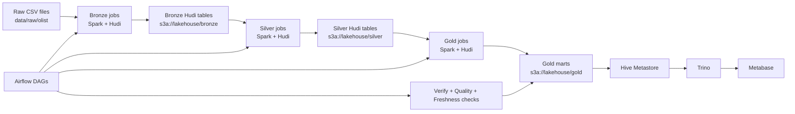

# Big Data Hudi E-commerce Pipeline

Local lakehouse project for e-commerce analytics built on `Apache Hudi`, `Spark`, `Trino`, `Airflow`, `MinIO`, and `Metabase`. The project ingests raw Olist CSV datasets, organizes them into `bronze -> silver -> gold` layers, validates data quality, exposes marts for BI, and includes Hudi-specific demos such as `incremental upsert` and `time travel`.

## Description

This repository implements a complete local data platform for batch analytics on e-commerce data. The core idea is:

- ingest raw source files into a local S3-compatible lake
- store curated tables in Hudi
- transform them across medallion layers
- orchestrate everything with Airflow
- query marts with Trino
- visualize results in Metabase

It is designed as a reproducible end-to-end pipeline rather than only a collection of Spark scripts.

## Objective

- Build a local lakehouse pipeline around `Apache Hudi`
- Model e-commerce data through `bronze`, `silver`, and `gold` layers
- Validate pipeline correctness with row-count, quality, freshness, and reconciliation checks
- Serve analytical marts for SQL and BI consumption
- Demonstrate Hudi capabilities beyond plain Parquet, especially:
  - `incremental upsert`
  - `time travel`

## Dataset

Main dataset:

- `Olist Brazilian E-Commerce Public Dataset`

Source files are stored under:

- `data/raw/olist/`

Main entities used in the pipeline:

- `orders`
- `order_items`
- `customers`
- `payments`
- `products`
- `sellers`
- `reviews`
- `geolocation`
- `product_category_translation`

These raw CSV files are transformed into:

- `bronze`: raw-preserving Hudi tables
- `silver`: cleaned and standardized Hudi tables
- `gold`: serving marts for analytics and BI

## Tools And Technologies

- `Apache Spark 3.5.8`: ETL and Hudi read/write jobs
- `Apache Hudi 1.1.1`: transactional lake table format
- `MinIO`: S3-compatible object storage
- `Hive Metastore`: metadata catalog for lakehouse tables
- `Trino`: SQL query engine
- `Apache Airflow 3`: orchestration and scheduling
- `Metabase`: BI and dashboard layer
- `Docker Compose`: local platform orchestration
- `Python`: pipeline jobs, helpers, validation scripts, and demos

## Architecture



Pipeline flow in practice:

1. Raw Olist CSV files are loaded into `bronze` Hudi tables.
2. `Silver` jobs standardize schemas, clean values, and preserve business keys.
3. `Gold` jobs build marts such as `daily_sales_gold`, `category_sales_gold`, and `customer_ltv_gold`.
4. `Airflow` orchestrates the full run.
5. `Trino` queries the final marts through `Hive Metastore`.
6. `Metabase` consumes those marts for dashboarding.

## Final Result

At the current state, the project already provides:

- a working end-to-end `raw -> bronze -> silver -> gold` Hudi pipeline
- successful orchestration with `Airflow`
- SQL access to `gold` tables via `Trino`
- BI connectivity through `Metabase`
- validation layers for:
  - pipeline row-count verification
  - data quality checks
  - freshness and reconciliation checks
- Hudi demo capabilities for:
  - `incremental upsert`
  - `time travel`

Key analytical outputs:

- `daily_sales_gold`
- `category_sales_gold`
- `customer_ltv_gold`

## Setup

Start the full local stack:

```bash
docker compose up -d \
  minio minio-init \
  metastore-postgres hive-metastore \
  spark-master spark-worker \
  trino \
  airflow-postgres airflow-init airflow-webserver airflow-dag-processor airflow-scheduler \
  metabase-postgres metabase
```

Run the full Hudi pipeline:

```bash
bash scripts/run_hudi_full_pipeline.sh
```

Verify data and query layer:

```bash
bash scripts/spark_submit_container.sh pipelines/tools/verify_hudi_pipeline.py
bash scripts/spark_submit_container.sh pipelines/tools/run_data_quality_checks.py
bash scripts/spark_submit_container.sh pipelines/tools/run_freshness_reconciliation_checks.py
bash scripts/run_trino_gold_checks.sh
```

Run the Hudi incremental upsert and time-travel demo:

```bash
bash scripts/run_hudi_incremental_demo.sh
```

Open local UIs:

- Airflow: `http://localhost:8080`
- Trino: `http://localhost:8081`
- Spark master UI: `http://localhost:8082`
- Spark worker UI: `http://localhost:8083`
- MinIO console: `http://localhost:9001`
- Metabase: `http://localhost:3000`

Detailed structure documentation: [docs/architecture/project-structure.md](/home/dohaidang/bigdata_hudi/docs/architecture/project-structure.md:1)
System design documentation: [docs/architecture/system-design.md](/home/dohaidang/bigdata_hudi/docs/architecture/system-design.md:1)
Data mapping documentation: [docs/architecture/data-mapping.md](/home/dohaidang/bigdata_hudi/docs/architecture/data-mapping.md:1)
Hudi in project documentation: [docs/architecture/hudi-trong-du-an.md](/home/dohaidang/bigdata_hudi/docs/architecture/hudi-trong-du-an.md:1)
Python files documentation: [docs/architecture/python-files-trong-project.md](/home/dohaidang/bigdata_hudi/docs/architecture/python-files-trong-project.md:1)
Input data and processing documentation: [docs/architecture/du-lieu-dau-vao-va-cach-xu-ly.md](/home/dohaidang/bigdata_hudi/docs/architecture/du-lieu-dau-vao-va-cach-xu-ly.md:1)
Airflow in project documentation: [docs/architecture/airflow-trong-du-an.md](/home/dohaidang/bigdata_hudi/docs/architecture/airflow-trong-du-an.md:1)
Docker stack documentation: [docs/runbooks/docker-stack.md](/home/dohaidang/bigdata_hudi/docs/runbooks/docker-stack.md:1)
Data quality checks documentation: [docs/runbooks/data-quality-checks.md](/home/dohaidang/bigdata_hudi/docs/runbooks/data-quality-checks.md:1)
Freshness and reconciliation checks documentation: [docs/runbooks/freshness-reconciliation-checks.md](/home/dohaidang/bigdata_hudi/docs/runbooks/freshness-reconciliation-checks.md:1)
BI demo guide: [docs/runbooks/bi-demo.md](/home/dohaidang/bigdata_hudi/docs/runbooks/bi-demo.md:1)
Hudi incremental/time travel demo: [docs/runbooks/hudi-incremental-time-travel-demo.md](/home/dohaidang/bigdata_hudi/docs/runbooks/hudi-incremental-time-travel-demo.md:1)
Project checklist: [docs/runbooks/project-checklist.md](/home/dohaidang/bigdata_hudi/docs/runbooks/project-checklist.md:1)

## Directory layout

- `docker/`: container definitions and service-specific assets
- `configs/`: runtime configs for Spark, Hudi, Trino, and Airflow
- `data/raw/`: landing zone for source datasets and API extracts
- `data/bronze/`: raw-modeled Hudi tables
- `data/silver/`: cleaned and conformed Hudi tables
- `data/gold/`: serving marts for BI and analytics
- `pipelines/extract/`: ingestion jobs from files or APIs
- `pipelines/bronze/`: raw-to-bronze load jobs
- `pipelines/silver/`: refinement and upsert jobs
- `pipelines/gold/`: mart-building jobs
- `pipelines/common/`: shared helpers, schemas, and utilities
- `sql/ddl/`: external table definitions and setup SQL
- `sql/queries/`: validation and demo queries
- `dags/`: Airflow orchestration
- `docs/architecture/`: diagrams and design notes
- `docs/runbooks/`: operational steps and troubleshooting
- `scripts/`: bootstrap and local utility scripts
- `tests/`: pipeline tests

## Immediate next steps

1. Expand freshness, drift, and reconciliation checks beyond the current baseline rules.
2. Add incremental Hudi write patterns where full reload is not the right long-term behavior.
3. Add dashboard or BI demo queries on top of `hive.analytics.*`.
